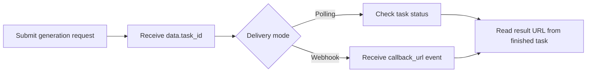

# Sora 2 Official API with APIDot

Build with the Sora 2 Official API using APIDot: cURL, Node.js, polling, webhooks, pricing, and fal.ai comparison in one production-oriented GitHub repo.

[Get API Key](https://apidot.ai/dashboard/api-key) | [API Docs](https://apidot.ai/docs/sora-2-official) | [Model Page](https://apidot.ai/models/sora-2-official) | [Main Examples](https://github.com/APIDotAI/apidot-examples)

## Overview

Sora 2 Official is OpenAI's Sora 2 video generation family for creating short clips from a written prompt or one optional guiding image. It belongs to the Sora line of models focused on realistic motion, cinematic scene construction, and prompt-driven video outputs.

The strongest reason to choose Sora 2 Official is official Sora 2 quality with a clear Standard and Pro choice. Standard is suited to 720p concept clips and lower-friction iteration, while Pro adds selectable 720p, 1024p, and 1080p output for teams that want sharper short video results from the same prompt or image-guided workflow.

On APIDot, Sora 2 Official is available as `sora-2-official` and `sora-2-pro-official` through one async video API. Submit a prompt, optional single `image_urls` reference, duration, aspect ratio, and Pro resolution when needed; APIDot returns a `task_id` for polling or `callback_url` delivery, with credits estimated from the selected duration and variant.

## Capabilities

- Prompt-to-video scene direction: Turn a written scene brief into a short video by describing subject, action, camera movement, mood, and visual style. This is useful for quickly testing ad concepts, story beats, and cinematic B-roll ideas.
- Single-image guided generation: Provide one optional reference image when the clip should start from or follow a specific product, subject, or visual cue. APIDot limits this workflow to one image so requests stay aligned with the current Sora 2 Official API boundary.
- Standard and Pro quality ladder: Use `sora-2-official` for standard 720p generation, or switch to `sora-2-pro-official` when a sharper output tier is worth the additional credits. Pro supports 720p, 1024p, and 1080p resolution choices.
- Duration and aspect control: Generate fixed 4, 8, 12, 16, or 20 second clips and choose landscape or portrait framing. Pro image-guided requests can also use `aspect_ratio: auto` when the uploaded image should drive the frame.
- Async production delivery: Submit longer video work as an async job instead of holding a frontend request open. Store the returned `task_id`, poll status, or provide a callback URL to receive the terminal task result.
- Predictable credit estimates: Estimate cost before submitting: Standard is priced by clip duration, while Pro is priced by selected resolution and seconds. This makes it practical to compare Standard and Pro outputs before scaling a workflow.

## Common use cases

Sora 2 Official fits teams that need official OpenAI video generation for polished short clips, not a broad video editing suite. It works well when the deliverable is a compact concept, preview, or campaign asset that can be described with a prompt or guided by one image.

- Cinematic ad concepts
- Product image animations
- Social video variants
- Storyboard shot previews
- Cinematic B-roll clips
- Model-quality comparison runs

## Pricing on APIDot

Catalog price: Starting at $0.240 / video.
Pricing snapshot: per video | Sora 2 Official: 4s 48 credits ($0.240), 8s 96 credits ($0.480), 12s 144 credits ($0.720), 16s 192 credits ($0.960), 20s 240 credits ($1.20); Sora 2 Pro Official: 720p 48 credits/sec ($0.240), 1024p 80 credits/sec ($0.400), 1080p 112 credits/sec ($0.560)

This README uses the pricing data currently published in the APIDot model catalog. Check the APIDot model page before high-volume production runs.

### Model-specific pricing

- sora-2-official: per video | 4s: 48 credits ($0.240), 8s: 96 credits ($0.480), 12s: 144 credits ($0.720), 16s: 192 credits ($0.960), 20s: 240 credits ($1.20)
- sora-2-pro-official: per second | 720p: 48 credits/sec ($0.240), 1024p: 80 credits/sec ($0.400), 1080p: 112 credits/sec ($0.560)

## APIDot vs fal.ai

For tiers with fal.ai comparison data in the APIDot catalog, APIDot shows up to 40% lower listed price. Treat this as a catalog snapshot and verify current pricing before launch.

| Tier | APIDot listed price | fal.ai listed price | Note |
| --- | ---: | ---: | --- |
| sora-2-official \| 4 seconds | $0.24 | $0.4 | APIDot is 40% lower in this tier |
| sora-2-official \| 8 seconds | $0.48 | $0.8 | APIDot is 40% lower in this tier |
| sora-2-official \| 12 seconds | $0.72 | $1.2 | APIDot is 40% lower in this tier |
| sora-2-official \| 16 seconds | $0.96 | $1.6 | APIDot is 40% lower in this tier |
| sora-2-official \| 20 seconds | $1.2 | $2 | APIDot is 40% lower in this tier |
| sora-2-pro-official \| 720p | $0.24 | $0.3 | APIDot is 20% lower in this tier |
| sora-2-pro-official \| 1024p | $0.4 | $0.5 | APIDot is 20% lower in this tier |
| sora-2-pro-official \| 1080p | $0.56 | $0.7 | APIDot is 20% lower in this tier |

## Quick start

    cp .env.example .env
    # Edit .env and set APIDOT_API_KEY
    cd node
    npm start

The same request shape is available as a copy-paste cURL example in curl/generate.md.

## API workflow



Use polling for local tests and webhook delivery for production queues. Store `data.task_id` before the first status check so retries, callbacks, and result URLs can be reconciled safely.

## Minimal API request

Submit to APIDot's unified async generation endpoint:

    POST https://api.apidot.ai/api/generate/submit
    Authorization: Bearer <APIDOT_API_KEY>
    Content-Type: application/json

Primary payload:

```json
{
  "model": "sora-2-official",
  "callback_url": "https://your-domain.com/callback",
  "input": {
    "prompt": "A cinematic tracking shot of a compact electric car driving through neon-lit rain, realistic reflections, slow camera push, dramatic product commercial style.",
    "duration": 8,
    "aspect_ratio": "16:9"
  }
}
```

Submit Sora 2 Official Standard or Pro video generation jobs through APIDot's unified async generation endpoint.

Sora 2 Official uses APIDot's shared async generation workflow. Send `sora-2-official` or `sora-2-pro-official` in top-level `model`, optional `callback_url`, and generation parameters inside `input`. The request body is always `{ "model": "...", "callback_url": "...", "input": { ... } }`.

## Model IDs and request variants

### sora-2-official

```json
{
  "model": "sora-2-official",
  "callback_url": "https://your-domain.com/callback",
  "input": {
    "prompt": "A cinematic tracking shot of a compact electric car driving through neon-lit rain, realistic reflections, slow camera push, dramatic product commercial style.",
    "duration": 8,
    "aspect_ratio": "16:9"
  }
}
```

### sora-2-pro-official

```json
{
  "model": "sora-2-pro-official",
  "callback_url": "https://your-domain.com/callback",
  "input": {
    "prompt": "Animate the product from the reference image as a premium launch teaser, slow dolly-in, clean studio lighting, realistic reflections, polished campaign video.",
    "duration": 8,
    "aspect_ratio": "auto",
    "resolution": "1024p",
    "image_urls": [
      "https://your-domain.com/product-reference.webp"
    ]
  }
}
```

## Request parameters

| Field | Type | Required | Description |
| --- | --- | --- | --- |
| model | string | yes | Target public model ID: `sora-2-official` or `sora-2-pro-official`. |
| callback_url | string | no | Optional webhook URL for terminal task updates. |
| input.prompt | string | yes | Text prompt for video generation. Describe the scene, action, camera, lighting, and style. |
| input.duration | integer | no | Video duration in seconds. Supported values are `4`, `8`, `12`, `16`, and `20`. |
| input.aspect_ratio | string | no | Output aspect ratio. Standard supports `16:9` and `9:16`. Pro text-to-video supports `16:9` and `9:16`; Pro image-to-video also supports `auto`. |
| input.image_urls | string[] | no | Optional image-guidance array. Send at most one image URL. |
| input.resolution | string | no | Pro-only output resolution. Supported values for `sora-2-pro-official` are `720p`, `1024p`, and `1080p`. Do not send this field for `sora-2-official`. |

## Practical integration notes

- Use `sora-2-official` for standard 720p Sora 2 clips and lower-cost iteration.
- Use `sora-2-pro-official` when you need `720p`, `1024p`, or `1080p` output control.
- Always send a specific `prompt` with subject, motion, camera, lighting, and style details.
- Send at most one URL in `input.image_urls` when using image-guided generation.
- Store the returned `task_id` and use status polling or `callback_url` for final delivery.

## Polling and webhooks

APIDot media generation is asynchronous. Store data.task_id immediately after submit, poll /api/generate/status/{task_id} for local tests, and use callback_url webhooks for production queues where users may leave the page before completion.

Webhook handlers should verify task ownership, persist callback events, return 2xx quickly, and be idempotent because duplicate deliveries can happen.

## Response and errors

- code: HTTP-style status code. Successful submits return `200`.
- data.task_id: Async task identifier returned immediately after submission.
- data.status: Initial task status, typically `not_started`.
- data.created_time: Task creation timestamp.

Common error classes:

- 400 invalid_request: Missing prompt, invalid duration, invalid aspect_ratio, invalid resolution, too many image URLs, or unsupported model ID.
- 401 authentication_error: Missing, expired, or invalid Bearer API key.
- 402 insufficient_credits: The current prepaid balance cannot cover the selected Sora 2 Official job.
- 429 rate_limited: Submission rate is temporarily above the current allowed limit.

## Production notes

- Keep APIDot API keys in server-side environment variables.
- Persist task_id, selected model, request payload, user ID, and status together.
- Use a moderate polling interval for tests and webhooks for durable production callbacks.
- Validate source media URLs before submitting requests that depend on source files.
- Avoid logging API keys, private prompts, private media URLs, or callback URLs.
- Retry transient network failures with backoff, but do not retry unchanged invalid payloads.

## FAQ

### What is Sora 2 Official useful for?

Sora 2 Official is useful for short, cinematic OpenAI video generation from a prompt or one guiding image. It fits ad concepts, product animations, social video variants, storyboard previews, and B-roll clips where official Sora 2 output quality matters more than advanced editing controls.

### Should I choose `sora-2-official` or `sora-2-pro-official`?

Choose `sora-2-official` for standard 720p clips and lower-cost iteration, and choose `sora-2-pro-official` when you need selectable 720p, 1024p, or 1080p output. Pro costs more because billing is based on resolution and seconds.

### Does Sora 2 Official support image-to-video?

Yes, APIDot supports optional single-image guided generation through `input.image_urls`. Send at most one image URL; multi-image references, start/end frame pairs, and source video editing are not part of this page's current API boundary.

### What duration and resolution can I generate?

Both variants support 4, 8, 12, 16, or 20 second clips. `sora-2-official` uses standard 720p output, while `sora-2-pro-official` supports `720p`, `1024p`, and `1080p` resolution choices.

### How are Sora 2 Official credits calculated?

Standard Sora 2 Official is billed by completed clip duration: 48, 96, 144, 192, or 240 credits for 4, 8, 12, 16, or 20 seconds. Pro is billed per second by resolution: 48 credits/sec at 720p, 80 credits/sec at 1024p, and 112 credits/sec at 1080p.

### How do I receive the generated video result?

Sora 2 Official uses APIDot's async task workflow. A successful submit returns `task_id`; you can poll `/api/generate/status/{task_id}` or provide `callback_url` so your webhook receives the final finished or failed task update.

### What should I avoid promising in a Sora 2 Official workflow?

Do not promise long-form video, frame-level editing, multi-image reference control, video-to-video editing, batch outputs, negative prompts, exact text rendering inside the scene, or detailed audio controls. Keep the workflow focused on prompt or single-image guided short video generation.

### Which model IDs are supported?

`sora-2-official` and `sora-2-pro-official`.

### Can I send multiple reference images?

No. The current Sora 2 Official workflow accepts at most one URL in `input.image_urls`.

### When is `aspect_ratio: auto` valid?

`auto` is valid for `sora-2-pro-official` only when `input.image_urls` is provided. Text-to-video requests should use `16:9` or `9:16`.

### Is APIDot the creator of the underlying model?

No. This is an APIDot integration repository for calling Sora 2 Official through APIDot. OpenAI is listed as the model provider in the APIDot catalog. Use the APIDot model page for current availability, pricing, and usage terms.

## Related links

- APIDot: https://apidot.ai
- Sora 2 Official model page: https://apidot.ai/models/sora-2-official
- Sora 2 Official API docs: https://apidot.ai/docs/sora-2-official
- APIDot quickstart: https://apidot.ai/docs/quickstart
- APIDot webhooks: https://apidot.ai/docs/webhooks
- Main APIDot examples repo: https://github.com/APIDotAI/apidot-examples

## Related APIDot model API repositories

More video API examples from APIDot:

| Model | Repository |
| --- | --- |
| Seedance 2 | [seedance-2-api](https://github.com/APIDotAI/seedance-2-api) |
| Happy Horse | [happy-horse-api](https://github.com/APIDotAI/happy-horse-api) |
| Veo 3.1 | [veo-3.1-api](https://github.com/APIDotAI/veo-3.1-api) |


